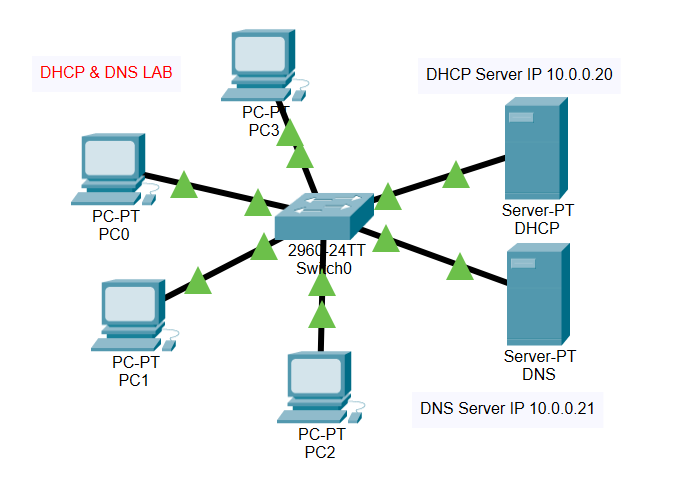
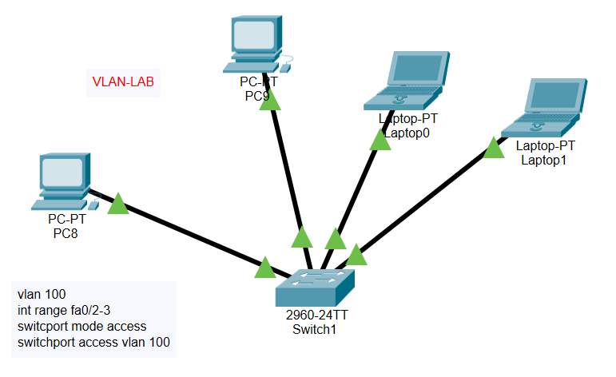
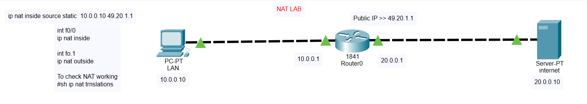
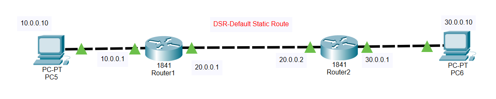
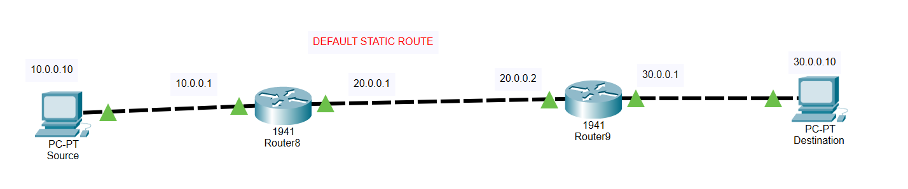
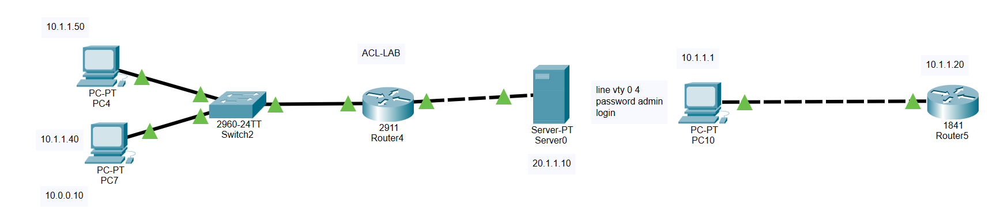

# CCNA Lab Portfolio — Jetking, Masters in Networking Administration

This repo documents practical lab work completed during my **CCNA certification** through Jetking's Masters in Networking Administration program (Belgaum). It includes Cisco Packet Tracer configuration labs and Wireshark packet capture analysis covering core networking protocols.

👤 For my professional/job experience, see: **[rehan-khadri-portfolio](https://github.com/rehankhadri108-coder/rehan-khadri-portfolio)**

📦 Full lab file: [`All_labs.pkt`](./packet-tracer/All_labs.pkt) *(open with Cisco Packet Tracer to explore all topologies interactively)*

---

## 🖧 Packet Tracer Labs

### 1. DHCP & DNS Lab


- Configured a DHCP server (`10.0.0.20`) to automatically assign IP addresses to 4 client PCs connected via a 2960-24TT switch
- Configured a DNS server (`10.0.0.21`) on the same network for name resolution
- Verified clients received correct IP addressing via DHCP and could resolve names via DNS

### 2. VLAN Lab


- Created VLAN 100 on a 2960-24TT switch and assigned it to a range of access ports
- Commands used:
  ```
  vlan 100
  interface range fa0/2-3
  switchport mode access
  switchport access vlan 100
  ```
- Connected 2 PCs and 2 laptops to test VLAN segmentation and access-port behavior

### 3. NAT Lab


- Configured static NAT on a Cisco 1841 router to translate a private LAN address to a public IP
- Inside network: `10.0.0.0/24` (PC at `10.0.0.10`) | Outside/public IP: `49.20.1.1` | Internet-side server: `20.0.0.10`
- Key commands:
  ```
  ip nat inside source static 10.0.0.10 49.20.1.1
  interface f0/0
  ip nat inside
  interface f0.1
  ip nat outside
  ```
- Verified translation using `show ip nat translations`

### 4. Default Static Route Lab (2-Router Topology)


- Connected two Cisco 1841 routers in series between two end PCs (`10.0.0.10` and `30.0.0.10`)
- Configured default static routes across Router1 (`10.0.0.1` / `20.0.0.1`) and Router2 (`20.0.0.2` / `30.0.0.1`) to enable end-to-end connectivity across three subnets

### 5. Default Static Route Lab (Alternate Topology)


- Same default static routing concept re-implemented using Cisco 1941 routers (Router8 and Router9) between a Source and Destination PC
- Practiced the same addressing/routing logic on a different router platform to reinforce the concept

### 6. ACL (Access Control List) Lab


- Multi-device topology with a 2960-24TT switch, a 2911 router, a 1841 router, a server, and multiple PCs across different subnets (`10.1.1.x`, `10.0.0.x`, `20.1.1.x`)
- Configured VTY line security on the router:
  ```
  line vty 0 4
  password admin
  login
  ```
- Set up to test access restrictions between subnets using Access Control Lists

---

## 📡 Wireshark Packet Capture Labs

Hands-on protocol analysis using Wireshark, capturing and inspecting live network traffic to understand how each protocol behaves at the packet level.

| Lab | Screenshot | What It Demonstrates |
|---|---|---|
| ARP Resolution + Ping | [`01-arp-packet-capture.png`](./wireshark-screenshots/01-arp-packet-capture.png) | ARP "Who has / is at" request-reply exchange to resolve MAC addresses, followed by an ICMP echo request/reply between the resolved hosts |
| DHCP DORA Process | [`02-dhcp-dora-broadcast.png`](./wireshark-screenshots/02-dhcp-dora-broadcast.png) | Full DHCP handshake — Discover → Offer → Request → Ack — captured between a client and DHCP server (192.168.0.1) |
| DNS Query | [`03-dns-packet-capture.png`](./wireshark-screenshots/03-dns-packet-capture.png) | Standard DNS query/response for an AAAA record (ocsp.verisign.net), showing recursive resolution across two DNS servers |
| DNS + TCP Handshake (Facebook) | [`04-facebook-pacp.png`](./wireshark-screenshots/04-facebook-pacp.png) | DNS lookup for www.facebook.com followed by a TCP 3-way handshake to port 80, captured in a lab/test environment |
| ICMP (Ping) | [`05-icmp.png`](./wireshark-screenshots/05-icmp.png) | Continuous ICMP echo request/reply sequence between two hosts, with incrementing sequence numbers |
| OSPF Neighbor Adjacency | [`06-ospf-neighbor-adjacency.png`](./wireshark-screenshots/06-ospf-neighbor-adjacency.png) | OSPF Hello packets exchanged over multicast (224.0.0.5) between two routers, followed by an LS Update once adjacency forms |
| SSL/TLS Handshake | [`07-ssl-test.png`](./wireshark-screenshots/07-ssl-test.png) | Full TLSv1 handshake — Client Hello → Server Hello/Certificate → Client Key Exchange/Change Cipher Spec → New Session Ticket → Encrypted Alert |
| UDP over IPv6 | [`08-ssl-pacp.png`](./wireshark-screenshots/08-ssl-pacp.png) | Connectionless UDP exchange over IPv6 addressing between two hosts *(file originally named for SSL, but the capture actually shows UDP/IPv6 traffic)* |
| TCP / Telnet | [`09-tcp-telnet.png`](./wireshark-screenshots/09-tcp-telnet.png) | TCP 3-way handshake (SYN → SYN-ACK → ACK) on port 23, followed by Telnet data exchange |
| Traceroute | [`10-traceroute-capture.png`](./wireshark-screenshots/10-traceroute-capture.png) | UDP probes with incrementing TTL, triggering "Time-to-live exceeded" ICMP replies from each intermediate hop |

*(Screenshots show the captured packets and protocol details directly from Wireshark)*

---

## 🎓 Certification

- **CCNA (Cisco Certified Network Associate)** — Masters in Networking Administration, Jetking, Belgaum

---

## 📫 Contact

- LinkedIn: [linkedin.com/in/rehan-khadri-29b73424b](https://www.linkedin.com/in/rehan-khadri-29b73424b)
- Email: rehankhadri108@gmail.com
